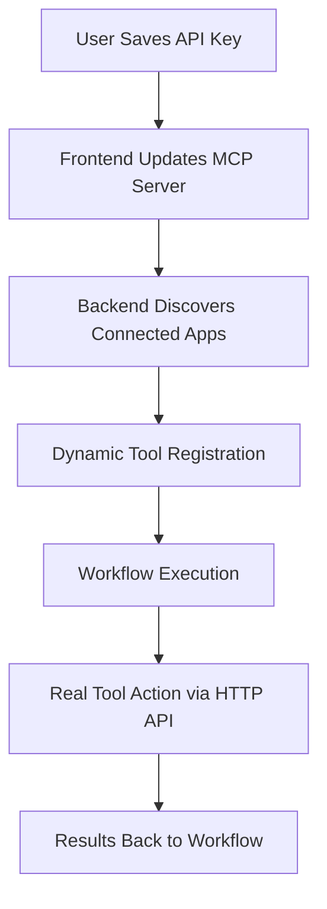

# Composio Integration Guide

## Overview

The Any-Agent Workflow Composer now features **full integration with Composio**, unlocking access to **100+ real-world tools and APIs** including Google Workspace, GitHub, Slack, Notion, CRM systems, and more. This integration transforms the platform from a proof-of-concept into a **production-ready enterprise automation tool**.

## 🎯 What This Integration Enables

### Real-World Automation Examples
- **Document Generation**: AI agents create Google Docs, Sheets, and Slides with real content
- **Project Management**: Automatic Jira ticket creation, Linear issue tracking, Trello card management
- **Communication**: Send Slack messages, Gmail emails, team notifications
- **Data Management**: Update Airtable records, Notion databases, CRM entries
- **Development**: Create GitHub issues, manage repositories, automate deployments

### Enterprise Workflow Capabilities
- **Cross-platform Integration**: Connect any tool to any other tool through AI reasoning
- **Smart Decision Making**: AI agents analyze data and choose appropriate workflow paths
- **Dynamic Parameter Generation**: Agents intelligently fill in tool parameters based on context

## 🏗️ Technical Architecture

### Components

1. **Frontend Integration**
   - User settings modal for Composio API key management
   - Per-user tool discovery and connection management
   - Dynamic tool node creation in workflow builder

2. **Backend MCP System** 
   - Per-user Composio client management with API key isolation
   - Dynamic action discovery from user's connected apps
   - Real-time tool execution with proper authentication

3. **Workflow Execution Engine**
   - Smart tool classification and auto-assignment
   - Type-safe parameter handling
   - Environment context propagation

### Data Flow



## 🚀 Setup and Configuration

### 1. Composio Account Setup

1. **Create Composio Account**: Go to [app.composio.dev](https://app.composio.dev)
2. **Get API Key**: Navigate to Settings → API Keys → Generate New Key
3. **Connect Your Apps**: Add integrations for tools you want to use (Google Docs, GitHub, etc.)

⚠️ **Important**: When connecting apps, ensure you grant **full permissions** (read + write), not just read access.

### 2. Any-Agent Configuration

1. **Open Workflow Composer**: Navigate to your deployed Any-Agent instance
2. **Open User Settings**: Click the settings icon in the top-right
3. **Add Composio API Key**: Paste your API key in the Composio section
4. **Test Connection**: Click "Test Connection" to verify setup
5. **Save Settings**: Your connected apps will automatically be discovered

### 3. Verify Integration

Check the browser console or backend logs for:
```
✅ Composio API key validated successfully
🔍 User connected apps: ['googledocs', 'github', 'slack']
✅ Discovered 15 real actions for user
```

## 📊 Usage Examples

### Example 1: Automated Document Creation

**Workflow**: Text Input → GPT-4o Agent → Text Output

**Agent Instructions**: 
```
You are a document creation specialist. When asked to create Google Docs, use your available Google Docs tool to create real documents with structured content.
```

**Result**: Creates actual Google Documents with generated content

### Example 2: Issue Tracking Automation

**Workflow**: Text Input → Analysis Agent → GitHub Tool → Notification Agent → Slack Tool

**Flow**: 
1. Analyze bug report
2. Create GitHub issue with proper labels
3. Send team notification via Slack

### Example 3: Multi-Tool Business Process

**Workflow**: Email Agent → CRM Update → Calendar Scheduling → Follow-up

**Flow**:
1. Process incoming leads
2. Update CRM records
3. Schedule meetings
4. Send automated follow-ups

## 🔧 Technical Implementation Details

### Key Breakthrough: Direct HTTP API Usage

The integration uses **direct HTTP API calls** instead of SDK wrappers for maximum compatibility:

```python
# Successful approach
async with session.post(
    f'https://backend.composio.dev/api/v2/actions/{tool_name}/execute',
    headers={'x-api-key': user_context.api_key},
    json={
        "input": params,
        "entityId": "default", 
        "appName": app_name  # Critical for authentication
    }
)
```

### Dynamic Tool Discovery

The system automatically discovers available tools based on user's connected apps:

```python
async def discover_actions_for_user(self, user_context: UserContext):
    # 1. Fetch user's connected accounts
    # 2. Query available actions for each app
    # 3. Cache results for performance
    # 4. Merge with fallback tools
```

### Per-User Authentication

Each user's API key is isolated and managed separately:

```python
@dataclass
class UserContext:
    user_id: str
    api_key: Optional[str] = None
    enabled_tools: List[str] = None
    preferences: Dict[str, Any] = None
```

## 🛠️ Available Tools

### Productivity Tools
- **Google Workspace**: Docs, Sheets, Slides, Calendar, Drive, Gmail
- **Microsoft Office**: Word, Excel, PowerPoint (via integrations)
- **Notion**: Page creation, database updates, content management
- **Airtable**: Record creation, data management

### Development Tools  
- **GitHub**: Issue creation, repository management, PR automation
- **GitLab**: Similar functionality for GitLab users
- **Jira**: Ticket creation, project management
- **Linear**: Issue tracking, project planning

### Communication
- **Slack**: Message sending, channel management
- **Discord**: Server and channel interactions
- **Microsoft Teams**: Team collaboration
- **Email**: Gmail, Outlook integration

### CRM & Sales
- **Salesforce**: Lead management, opportunity tracking
- **HubSpot**: Contact management, deal pipeline
- **Pipedrive**: Sales automation
- **Custom CRM integrations**

### 100+ Additional Tools
The integration supports any tool available in Composio's marketplace.

## 🐛 Troubleshooting

### Common Issues

#### 1. 403 Authentication Errors
**Symptom**: `Request had insufficient authentication scopes`

**Solution**: 
- Disconnect and reconnect the app in Composio dashboard
- Ensure you grant **full permissions** (not just read access)
- Verify API key is correct in user settings

#### 2. Tool Not Found Errors
**Symptom**: `Tool 'X' not found in available tools`

**Solution**:
- Ensure the app is connected in your Composio dashboard
- Check that the app name matches exactly
- Refresh the page to trigger tool rediscovery

#### 3. Dynamic Discovery Failures
**Symptom**: `Error fetching connected accounts: 404`

**Solution**:
- Verify API key is valid
- Check Composio service status
- Ensure network connectivity from backend to Composio

#### 4. Parameter Validation Errors
**Symptom**: `additionalProperties should not be set`

**Solution**:
- This is fixed in current version using strict parameter schemas
- Ensure you're using the latest code version

### Debugging Tips

1. **Check Browser Console**: Look for API validation messages
2. **Monitor Backend Logs**: Look for Composio discovery and execution logs
3. **Test API Key**: Use the "Test Connection" button in user settings
4. **Verify App Connections**: Check Composio dashboard for connected status

## 🔄 Updates and Maintenance

### Automatic Updates
- **Tool Discovery**: Runs automatically when user opens workflow composer
- **Cache Refresh**: Tool list refreshes every hour
- **Connection Validation**: API keys validated on each use

### Manual Refresh
- **User Settings**: Click "Test Connection" to force refresh
- **Backend Restart**: Clears all caches and rediscovers tools
- **App Reconnection**: Disconnect/reconnect in Composio for permission updates

## 🚀 Future Enhancements

### Planned Features
- **Workflow Templates**: Pre-built templates for common automation patterns
- **Bulk Operations**: Execute tools across multiple items
- **Conditional Logic**: Enhanced if/then/else workflow capabilities
- **Team Collaboration**: Share workflows and tool configurations
- **Advanced Monitoring**: Detailed execution analytics and error tracking

### Integration Roadmap
- **Enterprise SSO**: SAML/OAuth integration for team management
- **Custom Tool Creation**: Build and deploy custom Composio integrations
- **Marketplace**: Share and monetize workflow templates
- **API Rate Limiting**: Smart queuing and rate limit management

## 📈 Impact and Value

### Competitive Advantages
- **AI-Native**: Unlike traditional automation tools, every step can involve AI reasoning
- **Visual Workflow Building**: Drag-and-drop interface for complex automations
- **100+ Pre-Integrated Tools**: No API setup or development required
- **Enterprise-Ready**: Per-user authentication, security, and scalability

### Business Value
- **Time Savings**: Automate hours of manual work into minutes
- **Error Reduction**: Eliminate human errors in repetitive processes  
- **Scalability**: Handle increasing workload without additional staff
- **Integration**: Connect previously siloed tools and data

### Market Position
This integration positions Any-Agent as a serious competitor to:
- **Zapier** (automation platform)
- **Microsoft Power Automate** (workflow automation)
- **Integromat/Make** (visual automation builder)

But with the unique advantage of **AI reasoning at every step**.

---

## 📞 Support

For technical support or questions about the Composio integration:

1. **Documentation**: Check this guide and other documentation files
2. **Issues**: Report bugs via GitHub issues
3. **Community**: Join discussions in project forums
4. **Direct Support**: Contact the development team

---

*Last Updated: December 2024*
*Integration Version: 1.0*
*Composio API Version: v2* 